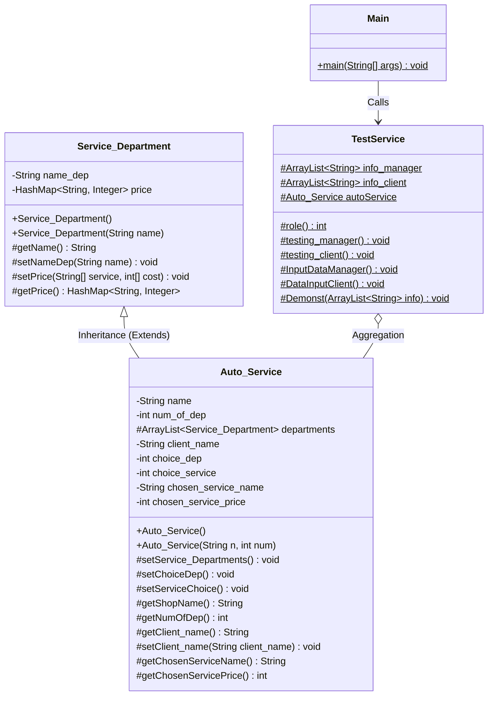

# Архітектура програмного забезпечення "Автосервіс"

Даний документ описує об'єктно-орієнтовану архітектуру консольного додатку "Автосервіс" (Car Repair Shop), створеного в рамках курсової роботи з ООП на мові Java.

## UML Діаграма Класів

## Опис Класів

### 1. `Service_Department` (Базовий клас)
Базовий клас, який представляє окремий відділ автосервісу (наприклад, "Шиномонтаж" або "Моторист").
- **Інкапсуляція:** Використовує приватні поля `name_dep` (назва відділу) та `price` (HashMap для зберігання прайс-листа).
- **Прайс-лист:** Використовується колекція `HashMap<String, Integer>`, де ключем є назва послуги, а значенням — її вартість у гривнях.

### 2. `Auto_Service` (Клас-спадкоємець)
Успадковує `Service_Department` (використано ключове слово `extends`). Описує весь автосервіс як єдине ціле.
- **Поля:** Містить назву всього сервісу, список відділів (через `ArrayList<Service_Department>`) та інформацію про вибір поточного клієнта.
- **Конструктори:**
  - `Auto_Service()`: Конструктор для режиму клієнта, який наповнює систему жорстко заданими (hardcoded) тестовими даними (3 відділи, по 3 послуги в кожному).
  - `Auto_Service(String n, int num)`: Конструктор для режиму менеджера, який дозволяє задати назву та кількість відділів під час виконання програми.

### 3. `TestService` (Клас-контролер)
Містить статичні методи для керування життєвим циклом програми та взаємодії з користувачем (Controller).
- **Колекції логів:** Використовує `ArrayList<String>` для зберігання історії операцій менеджера (`info_manager`) та чеків клієнтів (`info_client`).
- **Безпека введення:** У методах реалізовано обробку винятків `InputMismatchException` (через `try-catch`), що гарантує безперебійну роботу програми при помилковому введенні даних користувачем (наприклад, введення тексту замість числа).

### 4. `Main` (Точка входу)
Єдиний публічний клас у програмі. Містить метод `public static void main(String[] args)`, який викликає метод вибору ролі з `TestService` та спрямовує виконання в потрібний сценарій (клієнт або менеджер).
